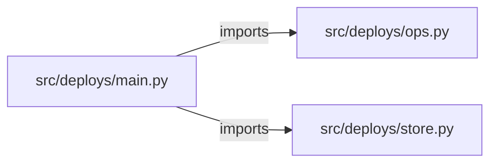

# fullstack-deployment-manager — project architecture

[README](README.md) · [Interview questions and answers](INTERVIEW_QA.md)

## Purpose and scope

The API records a deployment of a pinned image to `dev` or `staging` and walks it through a lifecycle. The React page in `web/src/App.tsx` creates deployments, moves them along, and offers a rollback when one fails.

This document describes files and symbols in this checkout. Deployment templates and statements in the original overview are distinguished from a verified running environment.

## Component diagram



For Python repositories, arrows show resolved local imports, not network calls or deployment order. Otherwise the diagram is a repository component map; containment arrows do not assert runtime integration.

## Components and responsibilities

| Component | Responsibility |
| --- | --- |
| [`src/deploys/main.py`](src/deploys/main.py) | HTTP handlers: `GET /healthz`, `GET /deployments`, `POST /deployments`, `GET /deployments/{deployment_id}`, `POST /deployments/{deployment_id}/status` |
| [`src/deploys/ops.py`](src/deploys/ops.py) | HTTP handlers: `GET /readyz`, `POST /workspaces`, `GET /workspaces`, `POST /workspaces/{workspace_id}/jobs`, `GET /jobs/{job_id}` |
| [`src/deploys/store.py`](src/deploys/store.py) | Functions: `now`, `__init__`, `__init__`, `clear`, `validate`, `create`, `get` |
| [`web/package.json`](web/package.json) | User interface code/assets |
| [`requirements.txt`](requirements.txt) | Implementation or supporting configuration |
| [`web/src/App.tsx`](web/src/App.tsx) | User interface code/assets |
| [`Dockerfile`](Dockerfile) | Container build/service configuration |
| [`Makefile`](Makefile) | Implementation or supporting configuration |
| [`docker-compose.yml`](docker-compose.yml) | Container build/service configuration |
| [`tests/test_deploys.py`](tests/test_deploys.py) | Executable checks and regression examples |
| [`tests/test_ops.py`](tests/test_ops.py) | Executable checks and regression examples |
| [`.github/workflows/ci.yml`](.github/workflows/ci.yml) | GitHub Actions job definitions |
| [`README.md`](README.md) | Project explanations or operating notes |
| [`docs/ARCHITECTURE.md`](docs/ARCHITECTURE.md) | Project explanations or operating notes |

## Existing design and operating guides

These checked-in guides provide the project’s detailed design, operational context, or deployment view:

- [`docs/ARCHITECTURE.md`](docs/ARCHITECTURE.md).

## Request interface

| Method and path | Handler | Source |
| --- | --- | --- |
| `GET /healthz` | `healthz` | [`src/deploys/main.py`](src/deploys/main.py#L33) |
| `GET /deployments` | `list_deployments` | [`src/deploys/main.py`](src/deploys/main.py#L38) |
| `POST /deployments` | `create_deployment` | [`src/deploys/main.py`](src/deploys/main.py#L43) |
| `GET /deployments/{deployment_id}` | `get_deployment` | [`src/deploys/main.py`](src/deploys/main.py#L48) |
| `POST /deployments/{deployment_id}/status` | `move_deployment` | [`src/deploys/main.py`](src/deploys/main.py#L53) |
| `POST /deployments/{deployment_id}/rollback` | `rollback_deployment` | [`src/deploys/main.py`](src/deploys/main.py#L58) |
| `GET /readyz` | `readyz` | [`src/deploys/ops.py`](src/deploys/ops.py#L44) |
| `POST /workspaces` | `create_workspace` | [`src/deploys/ops.py`](src/deploys/ops.py#L49) |
| `GET /workspaces` | `list_workspaces` | [`src/deploys/ops.py`](src/deploys/ops.py#L66) |
| `POST /workspaces/{workspace_id}/jobs` | `create_job` | [`src/deploys/ops.py`](src/deploys/ops.py#L73) |
| `GET /jobs/{job_id}` | `get_job` | [`src/deploys/ops.py`](src/deploys/ops.py#L96) |
| `POST /jobs/{job_id}/approve` | `approve_job` | [`src/deploys/ops.py`](src/deploys/ops.py#L105) |
| `GET /audit` | `audit` | [`src/deploys/ops.py`](src/deploys/ops.py#L122) |
| `GET /metrics` | `metrics` | [`src/deploys/ops.py`](src/deploys/ops.py#L138) |

The table lists literal route decorators found in the inspected Python modules. Router prefixes and middleware can add behavior; check the linked handler and application setup before calling an endpoint.

## Implementation walkthrough

### `create(self, name, environment, image, rollback_of=None)`

Source: [`src/deploys/store.py`](src/deploys/store.py#L44).

Calls visible in this function: `DeployError`, `len`, `now`, `self.rows.append`, `self.validate`.

```python
    def create(self, name, environment, image, rollback_of=None):
        self.validate(name, environment, image)
        active = [row for row in self.rows if row["name"] == name and row["environment"] == environment and row["status"] in {"pending", "running"}]
        if active:
            raise DeployError(f"{name} already has {active[0]['id']} in progress in {environment}", status=409)
        row = {
            "id": f"dep-{len(self.rows) + 1}",
            "name": name,
            "environment": environment,
            "image": image,
            "status": "pending",
            "rollback_of": rollback_of,
            "history": [{"status": "pending", "at": now()}],
        }
        self.rows.append(row)
        return row
```

### `rollback(self, deployment_id)`

Source: [`src/deploys/store.py`](src/deploys/store.py#L82).

Calls visible in this function: `DeployError`, `failed['id'].split`, `int`, `row['id'].split`, `self.create`, `self.get`.

```python
    def rollback(self, deployment_id):
        failed = self.get(deployment_id)
        if failed["status"] != "failed":
            raise DeployError("only a failed deployment can be rolled back", status=409)
        earlier = [
            row
            for row in self.rows
            if row["name"] == failed["name"]
            and row["environment"] == failed["environment"]
            and row["status"] == "succeeded"
            and int(row["id"].split("-")[1]) < int(failed["id"].split("-")[1])
        ]
        if not earlier:
            raise DeployError("no earlier successful deployment to roll back to", status=409)
        return self.create(failed["name"], failed["environment"], earlier[-1]["image"], rollback_of=failed["id"])
```

### `validate(self, name, environment, image)`

Source: [`src/deploys/store.py`](src/deploys/store.py#L32).

Calls visible in this function: `DeployError`, `IMAGE.fullmatch`, `image.endswith`, `re.fullmatch`.

```python
    def validate(self, name, environment, image):
        if environment == "prod":
            raise DeployError("prod is recorded by a pull request, not this form")
        if environment not in ENVIRONMENTS:
            raise DeployError("environment must be dev or staging")
        if not re.fullmatch(r"[a-z][a-z0-9-]{1,40}", name):
            raise DeployError("name must be lowercase letters, digits, and dashes")
        if not IMAGE.fullmatch(image):
            raise DeployError("image must be repository:tag")
        if image.endswith(":latest"):
            raise DeployError("pin a tag; latest is refused")
```

### `transition(self, deployment_id, status)`

Source: [`src/deploys/store.py`](src/deploys/store.py#L74).

Calls visible in this function: `DeployError`, `TRANSITIONS.get`, `now`, `row['history'].append`, `self.get`, `set`.

```python
    def transition(self, deployment_id, status):
        row = self.get(deployment_id)
        if status not in TRANSITIONS.get(row["status"], set()):
            raise DeployError(f"cannot move {row['id']} from {row['status']} to {status}", status=409)
        row["status"] = status
        row["history"].append({"status": status, "at": now()})
        return row
```

## Validation and failure paths

| Explicit exception | Source |
| --- | --- |
| `HTTPException(status_code=exc.status, detail=str(exc))` | [`src/deploys/main.py`](src/deploys/main.py#L29) |
| `HTTPException(status_code=404, detail='workspace not found')` | [`src/deploys/ops.py`](src/deploys/ops.py#L77) |
| `HTTPException(status_code=404, detail='job not found')` | [`src/deploys/ops.py`](src/deploys/ops.py#L100) |
| `HTTPException(status_code=404, detail='job not found')` | [`src/deploys/ops.py`](src/deploys/ops.py#L109) |
| `HTTPException(status_code=403, detail='production apply is disabled in this lab')` | [`src/deploys/ops.py`](src/deploys/ops.py#L113) |
| `DeployError('deployment not found', status=404)` | [`src/deploys/store.py`](src/deploys/store.py#L65) |
| `DeployError('prod is recorded by a pull request, not this form')` | [`src/deploys/store.py`](src/deploys/store.py#L34) |
| `DeployError('environment must be dev or staging')` | [`src/deploys/store.py`](src/deploys/store.py#L36) |
| `DeployError('name must be lowercase letters, digits, and dashes')` | [`src/deploys/store.py`](src/deploys/store.py#L38) |
| `DeployError('image must be repository:tag')` | [`src/deploys/store.py`](src/deploys/store.py#L40) |
| `DeployError('pin a tag; latest is refused')` | [`src/deploys/store.py`](src/deploys/store.py#L42) |
| `DeployError(f"{name} already has {active[0]['id']} in progress in {environment}", status=409)` | [`src/deploys/store.py`](src/deploys/store.py#L48) |
| `DeployError(f"cannot move {row['id']} from {row['status']} to {status}", status=409)` | [`src/deploys/store.py`](src/deploys/store.py#L77) |
| `DeployError('only a failed deployment can be rolled back', status=409)` | [`src/deploys/store.py`](src/deploys/store.py#L85) |
| `DeployError('no earlier successful deployment to roll back to', status=409)` | [`src/deploys/store.py`](src/deploys/store.py#L95) |

These are explicit exceptions in the inspected source, rather than a claim that every failure is handled. Follow the calling handler to see whether the exception becomes an HTTP response or propagates.

## Data and state

- [`src/deploys/ops.py`](src/deploys/ops.py) defines module-level containers: `_WORKSPACES`, `_JOBS`, `_AUDIT`, `_METRICS`.
- [`src/deploys/store.py`](src/deploys/store.py) defines module-level containers: `ENVIRONMENTS`, `TRANSITIONS`.

Module-level dictionaries/lists live in a Python process. They can be fixtures or mutable state; inspect writes before treating them as persistent storage. A production extension would need to define persistence and concurrency behavior explicitly.

## JavaScript/TypeScript execution contracts

| Manifest | Script | Command defined by the project |
| --- | --- | --- |

Run a script from the directory containing its manifest. Script names are package contracts; their presence does not show that their dependencies are installed or that they pass.

## Data flow and design decisions

### What is the input-to-output contract of `create`

In [`src/deploys/store.py`](src/deploys/store.py#L44), `create(self, name, environment, image, rollback_of=None)` receives the inputs. The function computes these intermediate values:

- `active = [row for row in self.rows if row['name'] == name and row['environment'] == environment and (row['status'] in {'pending', 'running'})]`
- `row = {'id': f'dep-{len(self.rows) + 1}', 'name': name, 'environment': environment, 'image': image, 'status': 'pending', 'rollback_of': rollback_of, 'history': [{'status': 'pending', 'at': now()}]}`

Its result is defined by:

- `row`

### Which decision rules or boundary conditions should an interviewer challenge

The implementation in [`src/deploys/store.py`](src/deploys/store.py#L44) branches on:

- `active`

A useful extension is a table-driven test that covers each condition just below, at, and above its boundary where applicable. These expressions are the current rules; changing them changes behavior and should be justified by the project’s acceptance criteria.

### What does `web/src/App.tsx` own

[`web/src/App.tsx`](web/src/App.tsx) defines `App`, `load`, `send`, `submit`. Its imports include `react`.

Trace these definitions and imports to explain the module boundary. Relative imports identify project code; package imports should be checked against the nearest manifest.

### What does the operations plane add, and where is its limit

[`src/deploys/ops.py`](src/deploys/ops.py) declares `GET /readyz`, `POST /workspaces`, `GET /workspaces`, `POST /workspaces/{workspace_id}/jobs`, `GET /jobs/{job_id}`, `POST /jobs/{job_id}/approve`, `GET /audit`, `GET /metrics`. Inspect the application’s `include_router` call for its URL prefix.

Its state containers are `_WORKSPACES`, `_JOBS`, `_AUDIT`, `_METRICS`. The job-approval handler defines whether a target is accepted or refused; check that branch and the associated tests instead of treating a recorded job as a successful infrastructure apply.

## Setup and verification

The following commands are derived from the checked-in dependency/test contracts. Execute them from the repository root; the block prepares a local environment, not a cloud deployment.

```bash
python3 -m venv .venv
source .venv/bin/activate
python -m pip install -r requirements.txt
python -m pytest -q
```

Python dependencies: [`requirements.txt`](requirements.txt).

Test entry points: [`tests/test_deploys.py`](tests/test_deploys.py), [`tests/test_ops.py`](tests/test_ops.py).

Automation definitions: [`.github/workflows/ci.yml`](.github/workflows/ci.yml). Read their triggers and job steps to determine what CI actually runs.

## Operating boundaries and design review

Before turning this checkout into a customer deployment, establish the input contract, data ownership, access controls, failure response, evaluation criteria, and rollback owner. Repository fixtures and unit tests demonstrate local behavior; they do not establish throughput, uptime, compliance, or business impact.

A useful architecture review starts with the linked implementation: identify where input enters, where a decision is made, which state can change, and which external dependency can fail. Add a deployment view only for infrastructure that is actually configured and exercised.
